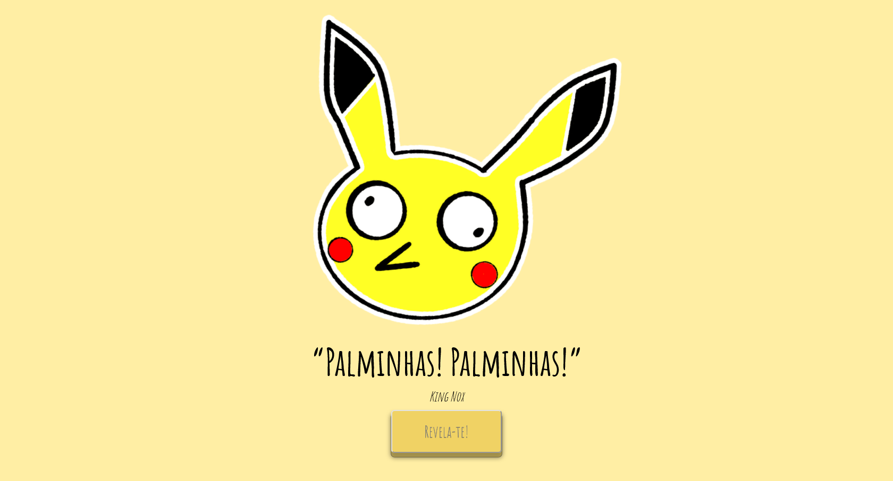
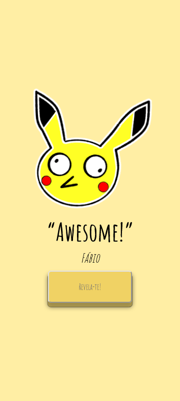

# Katxupi #44_kotxiposix quote generator

## Tech Stack

 
 

HTML, CSS, javaScript, Jest, Styled-components

---

## Why this project?

While building my first Freecodecamp's React project, Random Quote Machine, I realised the project was identical to the Master Coder PP's project from Academia de Código (Bootcamp). He used HTML, JavaScript and CSS.

After finish the Freecodecamp project on Codepen, I reused the code to rebuild PP's project in React.

Besides turning the project into React app, I added more quotes and author to the project. I Also did some CSS adjustments.

## Links

### Codepen
https://codepen.io/dnuns/pen/NWyWxxR

### PP's project
https://katxupi.herokuapp.com

### Katxupi #44_kotxiposix quote generator
https://katxupi-react.vercel.app/

## preview

---

## Available Scripts

In the project directory, you can run:

### `npm start`

Runs the app in the development mode.\
Open [http://localhost:3000](http://localhost:3000) to view it in your browser.

---

## Author

- [David Nunes](https://www.github.com/Dnuns)
